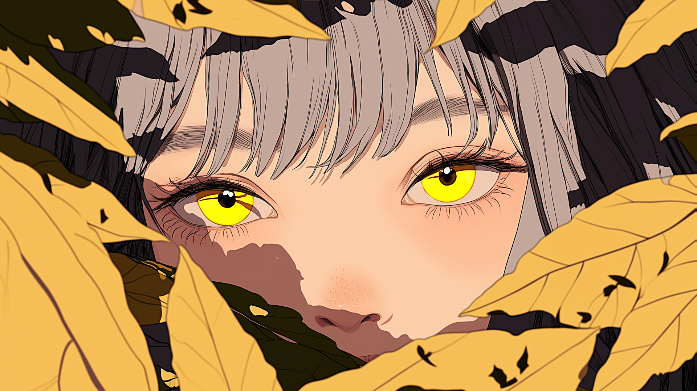

<h2 align="center">📋&ensp; <i>Ｓｏｂｒｅ</i> &ensp;📋</h2>

  <ul align="left" style="padding-right: 340px;">
    <li>☕ Technology</li> 
      <li>📢 Software Engineer 📢</li> 
    <li>💻 Front - Back - Mobile - Desktop 💻</li> 
  </ul>
      

<h2 align="center">👨🏻‍💻&ensp; <i>Ｐｒｏｊｅｔｏｓ</i> &ensp;👨🏻‍💻</h2>

  
  <table height="365px" width="365px">
  <tr>
      <td>
      
      </td>
    </tr>
    <tr>
      <td>
      
      </td>
    </tr>
    <tr>
      <td>
      
      </td>
    </tr>
        <tr>
<td>
  
</td>
  </table>

  

<h2 align="center">🛠️&ensp; <i>Ｔｅｃｎｏｌｏｇｉａ s</i> &ensp;🛠️</h2>

 

<table align="right" height="300px" width="275px" style="width: 650px; padding: 10px 0px 10px 10px;">
  <tr>
    <td align="center">
       
      
        <b>
          <pre>MYSQL</pre>
        </b>
      
    </td>
    <td align="center">
       
      
        <b>
          <pre>Adobe Photoshop</pre>
        </b>
      
    </td>
    <td align="center">
       
      
        <b>
          <pre>PHP</pre>
        </b>
      
    </td>
    <td align="center">
       
      
        <b>
          <pre>Adobe Premiere</pre>
        </b>
      
    </td>
  </tr>
  <tr>
    <td align="center" width="100px;">
       
      
        <b>
          <pre>Unity</pre>
        </b>
      
    </td>
    <td align="center">
       
      
        <b>
          <pre>C#</pre>
        </b>
      
    </td>
        <td align="center">
       
      
        <b>
          <pre>Visual Studio</pre>
        </b>
      
    </td>
        <td align="center">
       
      
        <b>
          <pre>JavaScript</pre>
        </b>
      
    </td>
  </tr>
  <tr>  
    <td align="center">
       
      
        <b>
          <pre>Bootstrap</pre>
        </b>
      
    </td>
    <td align="center" width="100px;">
       
      
        <b>
          <pre>Figma</pre>
        </b>
      
    </td>
    <td align="center">
       
      
        <b>
          <pre>HTML</pre>
        </b>
      
    </td>
    <td align="center">
       
      
        <b>
          <pre>CSS</pre>
        </b>
      
    </td>
  </tr>
  <tr>
    <td align="center">
       
      
        <b>
          <pre>Styled Components</pre>
        </b>
      
    </td>
    <td align="center">
       
      
        <b>
          <pre>SASS</pre>
        </b>
      
    </td>
    <td align="center">
       
      
        <b>
          <pre>Github</pre>
        </b>
      
    </td>
    <td align="center">
       
      
        <b>
          <pre>Git</pre>
        </b>
      
    </td>
  </tr>
</table>

                       

<h2 align="center">💬&ensp; <i>Ｃｏｎｔａｔｏ</i> &ensp;💬</h2>

  

    
    
  </a>
   
  </a> 
  </a>
  
  </a>

   

<h2 align="center">

  
📈&ensp; <i>Ａｔｉｖｉｄａｄｅ</i> &ensp;📈

   
  
  

  
    

    

 

