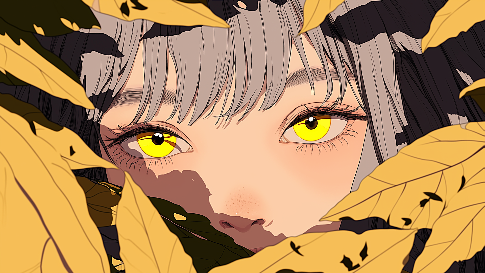

<h2 align="center">📋&ensp; <i>Ｓｏｂｒｅ</i> &ensp;📋</h2>

  <ul align="left" style="padding-right: 340px;">
    <li>☕ Technology</li> 
      <li>📢 Software Engineer 📢</li> 
    <li>💻 Front - Back - Mobile - Desktop 💻</li> 
  </ul>
      

<h2 align="center">👨🏻‍💻&ensp; <i>Ｐｒｏｊｅｔｏｓ</i> &ensp;👨🏻‍💻</h2>

  
  <table height="365px" width="365px">
  <tr>
      <td>

      </td>
    </tr>
    <tr>
      <td>
      
      </td>
    </tr>
    <tr>
      <td>
      
      </td>
    </tr>
        <tr>
<td>
  
</td>
  </table>

  

<h2 align="center">🛠️&ensp; <i>Ｔｅｃｎｏｌｏｇｉａｓ</i> &ensp;🛠️</h2>

<table>
  <tr>
    <td valign="top" width="33%">
      <h3 align="center">🌐 Frontend</h3>
      

         
        
      

    </td>
    <td valign="top" width="33%">
      <h3 align="center">⚙️ Backend</h3>
      

        
      

    </td>
    <td valign="top" width="33%">
      <h3 align="center">🎮 Game Dev</h3>
      

        
      

    </td>
  </tr>
  <tr>
    <td valign="top" width="33%">
      <h3 align="center">🎨 Design</h3>
      

        
      

    </td>
    <td valign="top" width="33%">
      <h3 align="center">🔧 Ferramentas</h3>
      

        
      

    </td>
    <td valign="top" width="33%">
      <h3 align="center">📱 Mobile</h3>
      

        
      

    </td>
  </tr>
</table>

  

<h2 align="center">💬&ensp; <i>Ｃｏｎｔａｔｏ</i> &ensp;💬</h2>

  

    
    
  </a>
   
  </a> 
  </a>
  
  </a>

   

<h2 align="center">

  
📈&ensp; <i>Ａｔｉｖｉｄａｄｅ</i> &ensp;📈

   
  
  
    

    

 

